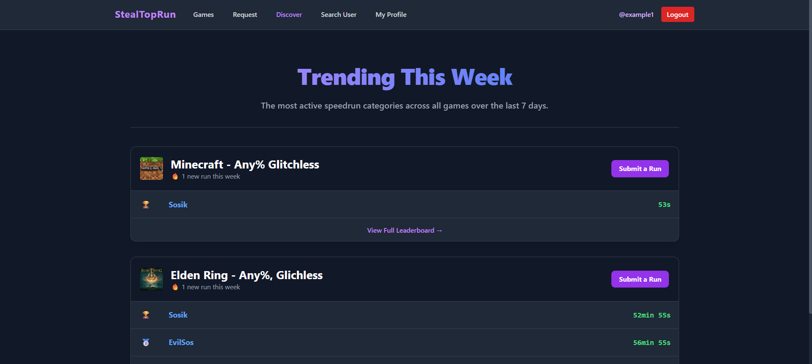

# StealTopRun-67
A Django based website for submitting, ranking and revision of speedruns. It aims to popularize speedrunning through fostering competition. Users are free to submit their own personal runs to compete in their favorite games and subcategories. 


## 👤 Team members:


- Urszula Chmielewska
- Mateusz Adamowicz
- Patryk Mikołajewicz
- Kamil Sas

# 🛠️ Instructions:

```bash


## Clone the repository
git clone https://github.com/Patmiko/StealTopRun-67
cd StealTopRun-67

## Requirements
pip install -r requirements.txt

## Run the manage file for the lab and get commands
python manage.py

## Make and run migrations
python manage.py makemigrations
python manage.py migrate

## Flush existing data (Optional: clear database for a fresh start)
# This will ask for confirmation; use --noinput to skip the prompt
python manage.py flush --noinput

## Populate database from JSON
# Ensure the file is saved as UTF-8
python manage.py loaddata initial_data.json

## Create root user 
python manage.py createsuperuser

## Start development server
python manage.py runserver

## Save the changes in database to json
python manage.py dumpdata main --format=json -o initial_data.json

```

## Documentation
For more technical information please head to DOCS.md file


### Class Diagram


## UI Screenshots

### User

#### Login Page


#### Create an Account


#### Registration Email


#### Main Page


#### Discover Screen


#### Browse Games Screen


#### Game Detail Screen


#### Speedrun Detail Screen


#### Report Speedrun


#### Submit a Request Screen


#### My Profile Screen


#### Edit User Profile


#### Search for User


#### Other User Profile


#### Report User


### Admin 

#### Administration Login


#### Administration Panel
