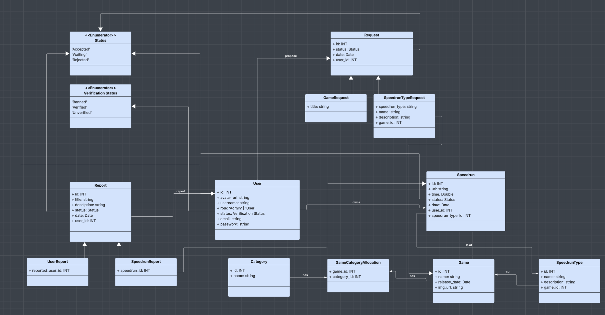
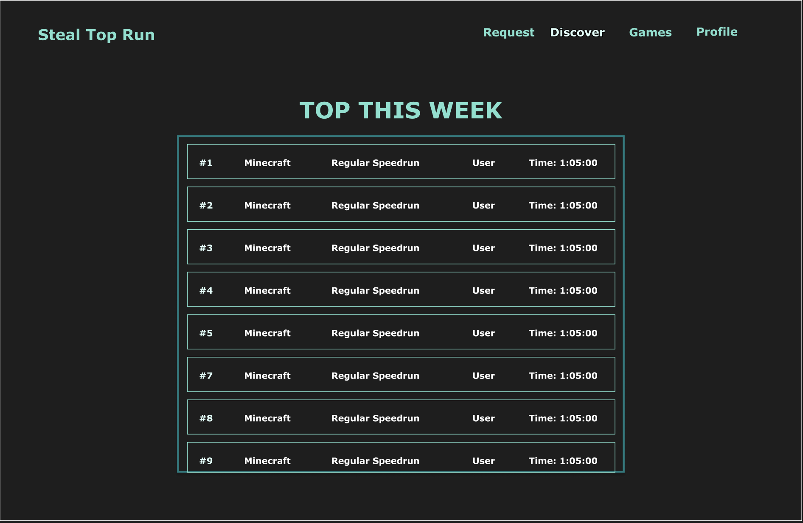
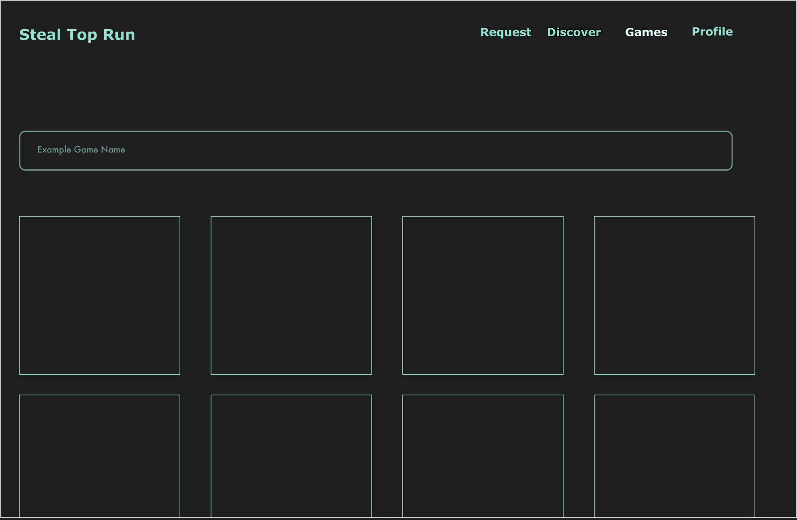
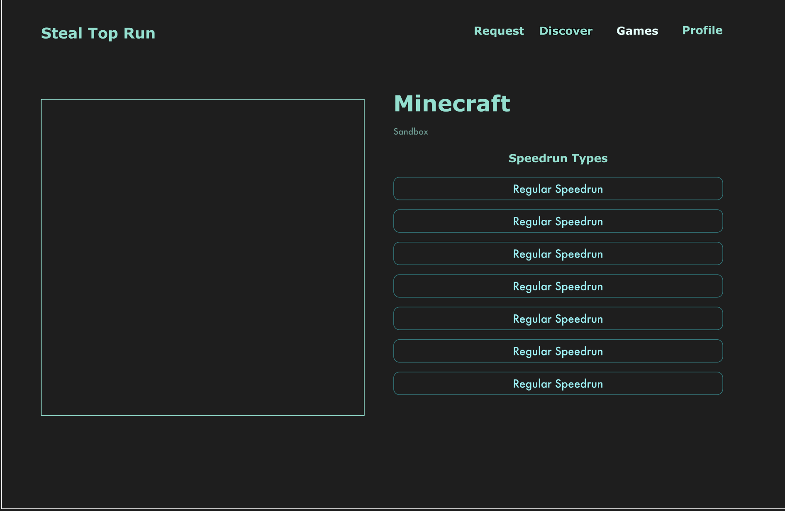
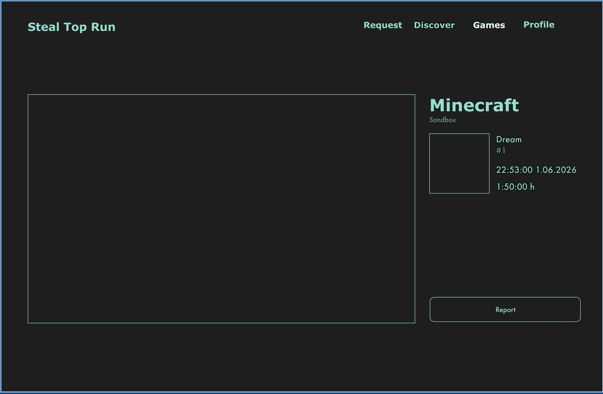
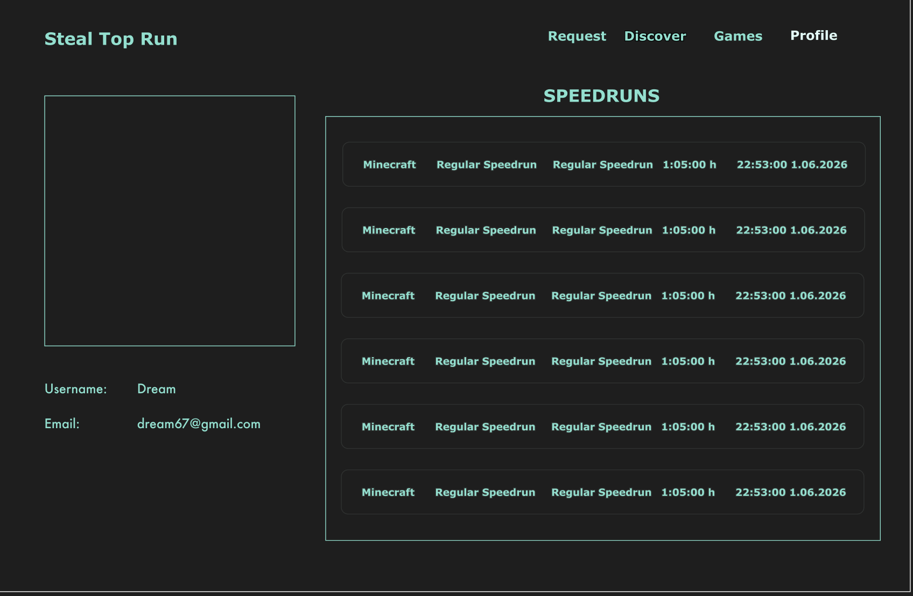
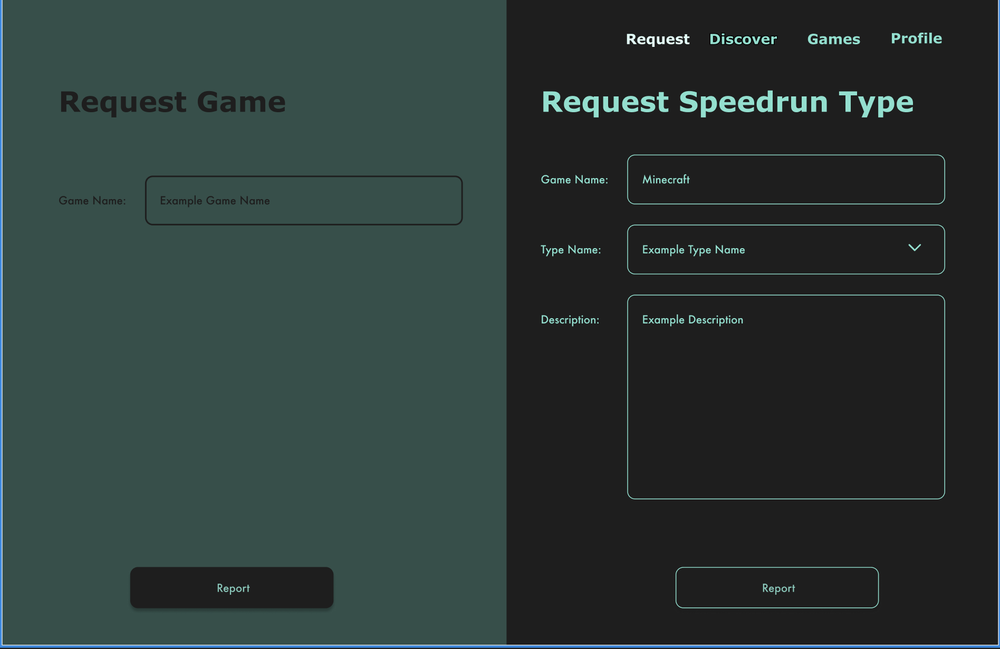

# StealTopRun-67
A Django based website for submitting, ranking and revision of speedruns. It aims to popularize speedrunning through fostering competition. Users are free to submit their own personal runs to compete in their favorite games and subcategories. 

## Commands.
```bash
# Creates new project environment.
conda create -n steal_top_run python=3.11

# Activates project environent.
conda activate steal_top_run

# In stalls django library.
conda install django

# Make migrations.
python manage.py makemigrations

# Migrates all migrations to database.
python manage.py migrate

# Creates admin.
python manage.py createsuperuser

# Runs server.
python manage.py runserver

# Run tests.
python manage.py test
```

## How to use.
At `http://127.0.0.1:8000/admin/` you can find admin panel.


## Documentation.

### Class Diagram


## UI Prototype

### Discover Screen


### Games Screen


### Speedrun Types Screen


### Speedruns Screen


### Speedrun Screen


### Profle Screen


### Request Screen
